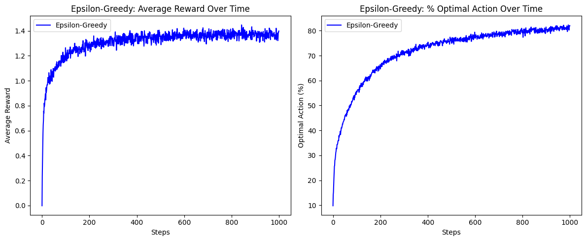
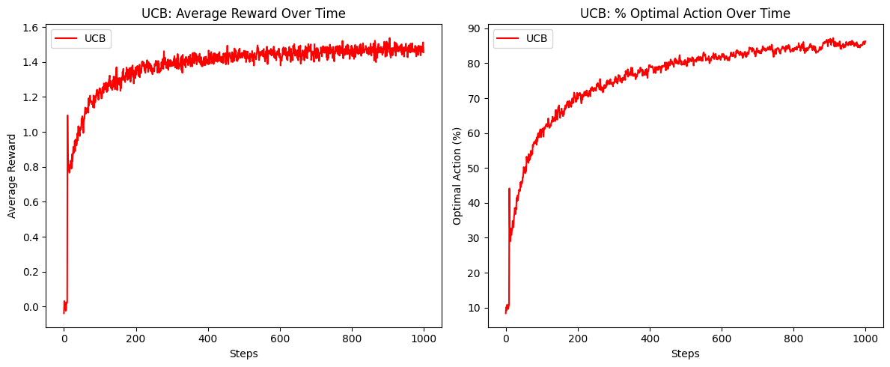
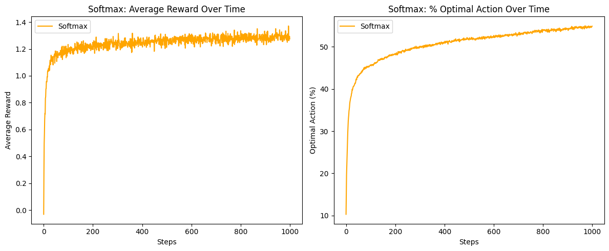
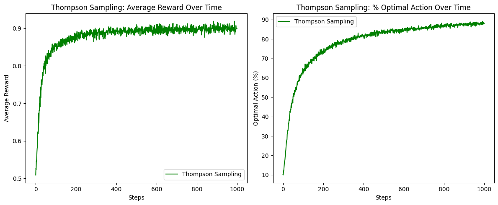

# **Epsilon-Greedy** 

## 算法公式

### 動作選擇規則：
$$
\displaystyle
a_t =
\begin{cases}
\text{random action from } \mathcal{A}, & \text{with probability } \varepsilon \\
\arg\max_a Q_t(a), & \text{with probability } 1 - \varepsilon
\end{cases}
$$ 

### 動作值更新（Incremental Update Formula）：
$$
\displaystyle
Q_{t+1}(a) = Q_t(a) + \frac{1}{N_t(a)} (R_t - Q_t(a))
$$

## ChatGPT Prompt 
```text 
You are a reinforcement learning tutor.
Please explain how the Epsilon-Greedy algorithm balances exploration and exploitation in the Multi-Armed Bandit problem.
Include an explanation of how epsilon is used to choose between random action selection and choosing the action with the highest estimated value.
Also, explain how the value estimates are updated.
```

## 程式碼與圖表
### code generated in `Epsilon-Greedy.ipynb`  



## 結果解釋  
```text 
從圖中可以觀察到：

- **平均報酬（左圖）** 隨著步數的增加穩定上升，初期迅速爬升，在約 400 步後趨於平穩，最終收斂於約 **1.35 左右**。這表示 agent 成功學會選擇報酬較高的動作。
- **最佳動作選擇比例（右圖）** 起初約為 10%，隨訓練次數推進穩定成長，最終達到約 **80% 的選擇正確率**，代表 agent 對最優動作的識別效果良好。
- 使用 $\varepsilon = 0.1$ 時，Epsilon-Greedy 在探索與利用之間取得良好平衡，保留了足夠探索機會來避免過早收斂，同時能穩定地學習有效策略。
- 本演算法在每個 time step 僅需 $O(1)$ 的更新與選擇操作，空間上只需儲存每個動作的 $Q(a)$ 和 $N(a)$，適合應用於大量重複試驗的學習任務。
```


# **UCB (Upper Confidence Bound)** 

## 算法公式

### 動作選擇規則：
$$
\displaystyle
a_t = \arg\max_a \left[ Q_t(a) + c \cdot \sqrt{ \frac{ \ln t }{ N_t(a) + \epsilon } } \right]
$$

### 動作值更新（Incremental Update Formula）：
$$
\displaystyle
Q_{t+1}(a) = Q_t(a) + \frac{1}{N_t(a)} (R_t - Q_t(a))
$$

## ChatGPT Prompt 
```text 
You are a reinforcement learning tutor.
Please explain the Upper Confidence Bound (UCB) algorithm used in the Multi-Armed Bandit problem.
Describe how it balances exploration and exploitation by adjusting the confidence term based on the number of times an action has been selected.
Explain how the constant c affects exploration, and how the action selection formula evolves as more steps are taken.
```

## 程式碼與圖表
### code generated in `UCB.ipynb` 



## 結果解釋
```text
從圖中可以觀察到：

- **平均報酬（左圖）** 隨著步數增加穩定上升，初期迅速爬升，約在第 300 步後趨於平穩，最終收斂於約 **1.45～1.5 左右**。這顯示 agent 成功學會集中選擇報酬較高的動作。
- **最佳動作選擇比例（右圖）** 初期約為 10%，迅速成長並最終穩定於 **85%～88%**，代表 agent 對最優動作的辨識與執行效果良好。
- UCB 無需預先設定探索率，透過動態調整的 confidence term 達成探索與利用的平衡，避免陷入固定策略的局限。
- 常數 $c=2$ 提供適當探索壓力，若 $c$ 調整不當會導致過度探索或早期收斂。
- 本演算法在每個 time step 僅需 $O(1)$ 的更新與選擇操作，空間上只需儲存每個動作的 $Q(a)$ 與 $N(a)$，適合應用於大量重複試驗的學習任務。
```

# **Softmax** 

## 算法公式

### 動作選擇機率：
$$
\displaystyle
P(a) = \frac{ \exp\left( \frac{Q_t(a)}{\tau} \right) }{ \sum_b \exp\left( \frac{Q_t(b)}{\tau} \right) }
$$

### 動作值更新（Incremental Update Formula）：
$$
\displaystyle
Q_{t+1}(a) = Q_t(a) + \frac{1}{N_t(a)} (R_t - Q_t(a))
$$

## ChatGPT Prompt 
```text 
You are a reinforcement learning tutor.
Please explain the Softmax (Boltzmann exploration) algorithm used in the Multi-Armed Bandit problem.
Describe how the temperature parameter τ controls the balance between exploration and exploitation, and how the action selection probability is calculated using estimated Q values.
Also, explain how different values of τ affect learning performance.
```

## 程式碼與圖表
### code generated in `Softmax.ipynb` 



## 結果解釋
```text
從圖中可以觀察到：

- **平均報酬（左圖）** 穩定上升，初期學習速度良好，但最終收斂於約 **1.25～1.3**，略低於 UCB 與 Epsilon-Greedy，代表選擇仍較分散。
- **最佳動作選擇比例（右圖）** 最終約為 **55%～58%**，顯示 agent 並未持續聚焦於最優選項，符合 Softmax 探索性強的特性。
- Softmax 利用溫度參數 $\tau$ 調節探索程度，本實驗中 $\tau = 0.1$，雖非極高，但仍保留一定程度的隨機性，導致最佳動作選擇率略低。
- 相較於 Epsilon-Greedy 與 UCB 的策略偏向 exploitation，Softmax 保有機率性探索，適合於不確定性高或非靜態報酬的場景。
- 此演算法計算每個動作機率需進行 softmax，計算成本略高於貪婪策略，但依然能以 $O(k)$ 完成，適用於中等規模行動空間。
```

# **Thompson Sampling**

## 算法公式

### 對於每一個動作 𝑎，Thompson Sampling 的步驟如下：
### 1. 為每個動作維護一個機率分布（例如：貝他分布）
### 2. 從該分布中隨機抽樣一個值：

$$
\displaystyle
\theta_a \sim \text{Beta}(\alpha_a, \beta_a)
$$

### 3. 選擇具有最大抽樣值的動作：

$$
\displaystyle
a_t = \arg\max_a \theta_a
$$

## ChatGPT Prompt 
```text 
You are a reinforcement learning tutor.
Please explain the Thompson Sampling algorithm used in the Multi-Armed Bandit problem.
Describe how the algorithm maintains a posterior distribution for each action and selects actions by sampling from these distributions.
Explain how the algorithm naturally balances exploration and exploitation through probabilistic sampling, and how it updates its belief using reward feedback.
```

## 程式碼與圖表
### code generated in `Thompson Sampling.ipynb` 



### 結果解釋
```text
從圖中可以觀察到：

- **平均報酬（左圖）** 隨時間穩定上升，約在 300 步後趨於平緩，最終收斂於 **0.9 左右**，符合 Bernoulli 環境的最大可能期望。
- **最佳動作選擇比例（右圖）** 起始約為 10%，迅速提升並在約 1000 步後穩定於 **87～89%**，代表 agent 能成功辨識並偏好選擇最佳動作。
- Thompson Sampling 透過對每個動作建立後驗分布，根據機率抽樣進行選擇，在學習初期具有高度探索性，而後逐漸專注於報酬較佳的選項。
- 相較於 ε-Greedy 或 UCB，Thompson Sampling 不需要顯式的超參數調節（如 ε 或 c），而是依據獎勵數據動態調整，具有更強的自適應性。
- 此演算法每一步以 $O(k)$ 抽樣與比較方式選取動作，且僅需維護每個動作的成功/失敗計數，非常適合處理 Bernoulli 型 bandit 問題。
```
